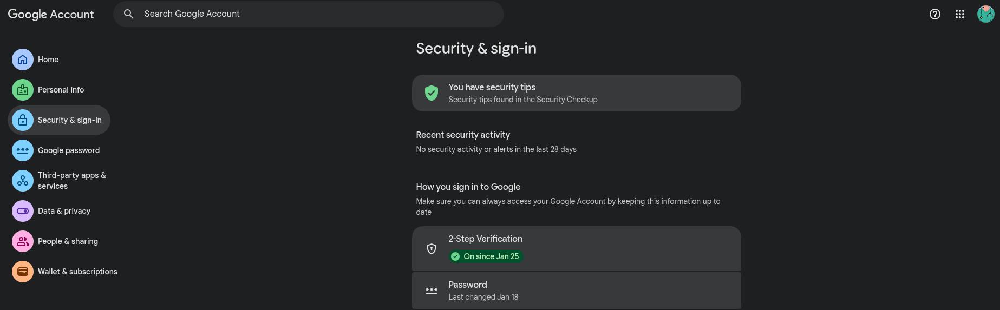
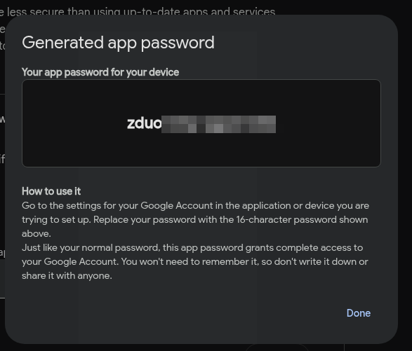

# Atividade 8

## Objetivo

Criar uma API HTTP simples para envio de e-mails através do protocolo SMTP. Utilizaremos Python para realizar a implementação, podendo ser adaptado para qualquer outra linguagem de programação que suporte aplicações web.

A API contará com um endpoint HTTP que deve ser capaz de receber requisições POST. Essas requisições terão alguns dados contidos em seu corpo, que deverão ser utilizados como forma de enviar um email para um determinado destinatário.

Não será necessário utilizar máquinas virtuais para essa atividade, podendo ser realizada em um ambiente local.

## Link para o Vídeo de Demonstração

[Vídeo de Demonstração](https://youtu.be/VeRu7NsAFS0)

## Pré-requisitos

- Python 3.x
- Possuir uma conta de email para enviar os emails (ex: Gmail, Outlook, etc)

## Configuração do Email

Primeiramente, é necessário configurar o _user agent_, que nesse caso será o gmail. Acessando qualquer serviço do Google, clique no ícone do seu perfil e depois em "Gerenciar sua Conta do Google".


Na aba "Segurança e Sign-in", ative a verificação em duas etapas, clicando em "Ativar" e seguindo os passos indicados.



Digite "senhas de app" na barra de pesquisa e clique no resultado "Senhas de app".

Digite um nome para a senha de app, como "SMTP API", e clique em "Gerar". Copie a senha gerada, pois ela será utilizada para autenticar a API SMTP.



## Configuração da API

Primeiramente, crie um arquivo `.env` na raiz do projeto e adicione a senha de app gerada no passo anterior:

```env
MAIL_USER=sua_conta_de_email_aqui
MAIL_PASSWORD=sua_senha_de_app_aqui
```

Agora, crie o arquivo `smtpconn.py` e adicione o seguinte código:

```python
import smtplib
from email.mime.text import MIMEText

class SmtpConn():
  def __init__(self, sourceMail, password):
    self.mail = sourceMail
    self.connection = smtplib.SMTP('smtp.gmail.com', 587)
    self.connection.ehlo()
    self.connection.starttls()
    self.connection.login(self.mail, password)

  def sendMail(self, destinationMail, subject, message):
    try:
      msg = MIMEText(message, 'plain', 'utf-8')
      msg['From'] = self.mail
      msg['To'] = destinationMail
      msg['Subject'] = subject
      
      self.connection.sendmail(self.mail, destinationMail, msg.as_string())
      
      response = "Email enviado com sucesso!\n"
      print(response)
      return response
    except Exception as e:
      response = f"Erro ao enviar e-mail: {e}\n"
      print(response)
      return response
```

Resumo do script:

- Quando a classe `SmtpConn` é instanciada com o email e a senha de app, ela executa o método `ehlo()`, que é utilizado para identificar o cliente para o servidor SMTP.
- Em seguida, o método `starttls()` é chamado para iniciar uma conexão segura utilizando TLS (Transport Layer Security).
- Por fim, o método `login()` é utilizado para autenticar a conexão com o servidor SMTP utilizando o email e a senha de app fornecidos.
- O método `sendMail()` é responsável por enviar o email para o destinatário especificado, utilizando o método `sendmail()` da conexão SMTP.

Agora, crie o arquivo `main.py` e adicione o seguinte código:

```python
from http.server import BaseHTTPRequestHandler, HTTPServer
from smptconn import SmtpConn
import json
import logging
import os
from dotenv import load_dotenv

load_dotenv()
EMAIL = os.getenv("MAIL_USER")
PASS = os.getenv("MAIL_PASSWORD")

logging.basicConfig(level=logging.INFO)
try:
  smtpConn =  SmtpConn(EMAIL, PASS)
  print("Conectado com sucesso ao email.")
except:
  print("Falhou ao conectar com Email.")
  exit()

class SimpleHTTPRequestHandler(BaseHTTPRequestHandler):
  def do_POST(self):
    if self.path == "/":
      content_length = int(self.headers["Content-Length"])
      post_data = self.rfile.read(content_length)
      try:
        data = json.loads(post_data)
        response = smtpConn.sendMail(data["email"], data["subject"], data["message"])
        self._send_response(201, response)
      except json.JSONDecodeError:
        self._send_response(400, {"error": "Invalid JSON"})
    else:
      self._send_response(404, {"error": "Invalid endpoint"})

  def _send_response(self, status_code, body):
    self.send_response(status_code)
    self.send_header("Content-Type", "application/json")
    self.end_headers()
    self.wfile.write(json.dumps(body).encode("utf-8"))

if __name__ == "__main__":
  server_address = ("", 8080)
  httpd = HTTPServer(server_address, SimpleHTTPRequestHandler)
  print("Servidor rodando em http://127.0.0.1:8080")
  httpd.serve_forever() 
```

Resumo do script:

- O script utiliza os dados do arquivo `.env` para obter o email e a senha de app, e tenta estabelecer uma conexão com o servidor SMTP utilizando a classe `SmtpConn`.
- A classe `SimpleHTTPRequestHandler` é responsável por lidar com as requisições HTTP.
- O método `do_POST()` é chamado quando uma requisição POST é recebida. Ele verifica se o endpoint é válido, lê os dados do corpo da requisição, e tenta enviar um email utilizando o método `sendMail()` da classe `SmtpConn`. Dependendo do resultado, ele retorna uma resposta HTTP adequada.
- O método `_send_response()` é utilizado para enviar a resposta HTTP com o status code e o corpo da resposta em formato JSON.
- Por fim, o servidor é iniciado na porta 8080 e fica aguardando requisições.

Caso algum erro de biblioteca seja encontrado, instale as dependências utilizando o comando:

```bash
pip install <nome_da_biblioteca>
```

De preferência, utilize um ambiente virtual para gerenciar as dependências do projeto.

## Testando a API

Em um terminal, execute o script `main.py` para iniciar o servidor:

```bash
python main.py
```

O servidor estará rodando em `http://127.0.0.1:8080`. Para testar a API, execute o seguinte comando:

```bash
curl -k  -X POST -H "Content-Type: application/json" --data ' {"email":"<email>","subject":"<assunto do email>","message":"<corpo do email>"}' localhost:8080
```

Verifique se o email foi enviado com sucesso para o destinatário especificado. Você pode verificar a caixa de entrada do email destinatário para confirmar o recebimento do email.
